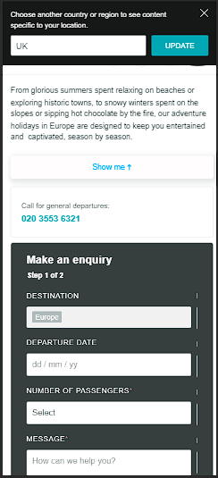

# Take Home Test – Associate Product Engineer, Travelopia

Hosted on netlify [click here](https://takehometestbunalinsahani.netlify.app/)

## The conversion rate

The "Show Me" button is a user interface element designed to reveal additional content or trigger specific actions when clicked. In conjunction with lazy loading optimization, this button ensures more efficient use of resources by delaying the loading of non-essential images until they are needed.

---
